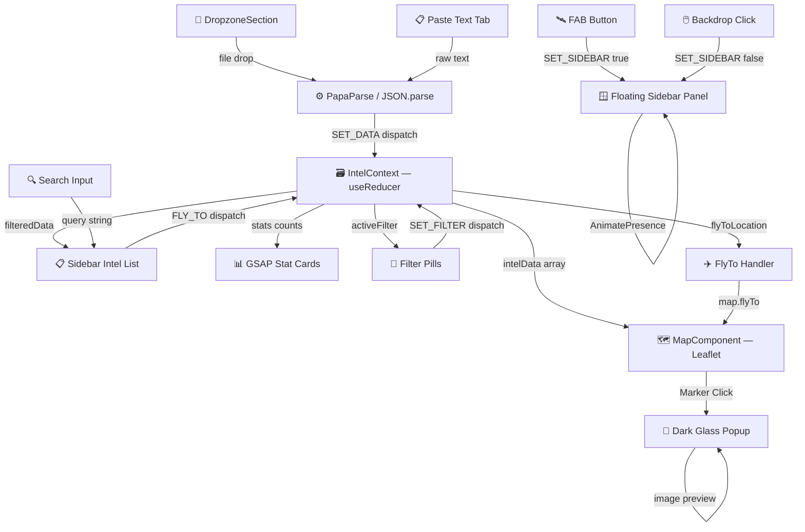

<div align="center">


<br/>


<br/><br/>


<br/><br/>


<br/><br/>

[](https://vercel.com/new/clone?repository-url=https%3A%2F%2Fgithub.com%2Fkinshukkush%2FINTEL-FUSION-DASHBOARD)

</div>

---

## ⚡ What Is This Project?

The **Multi-Source Intelligence Fusion Dashboard** is a high-performance, dark-themed web application engineered for geographic intelligence analysis. It acts as a **local fusion center** where analysts, journalists, researchers, or developers can visualize fragmented intelligence data from multiple sources across an interactive world map.

> 💡 **No backend required.** The entire system runs client-side. Your data never leaves your machine.

This dashboard supports three intelligence types following standard OSINT/HUMINT/IMINT classification:

| Symbol | Type | Color | Description |
|--------|------|-------|-------------|
| 🔵 | **OSINT** | `#3B82F6` | Open Source Intelligence — social media, news, intercepts |
| 🟢 | **HUMINT** | `#10B981` | Human Intelligence — field assets, contacts, ground reports |
| 🔴 | **IMINT** | `#EF4444` | Imagery Intelligence — satellite, drone, aerial surveillance |

---

## ✨ Features

<table>
<tr>
<td width="50%">

### 🗺️ Full-Screen Interactive Map
- Dark-themed CartoDB tile layer with custom CSS filters
- Smooth `flyTo()` transitions on intel card click
- Radar-ping animated SVG markers per intel type
- Gradient pin icons with inner dot indicator
- Clustered markers for performance at scale

</td>
<td width="50%">

### 🪟 Floating Sidebar Panel
- Hovers above the map — **does not compress it**
- 420px wide for maximum data visibility
- Spring-physics open/close animation (Framer Motion)
- **Click outside to dismiss** (backdrop overlay)
- ✕ button with 90° rotation animation

</td>
</tr>
<tr>
<td>

### 📂 Live Data Ingestion
- Drag & drop `.json` or `.csv` files directly
- PapaParse CSV streaming with header auto-detection
- JSON array or single object support
- Success animation with ingested record count
- Supports `id`, `lat`, `lng`, `type`, `title`, `description`, `image`

</td>
<td>

### 🎨 Premium Dark Glassmorphism UI
- Background: `#0a0a0f` deep space black
- Glass panels: `rgba(14,14,22,0.97)` + `backdrop-blur(20px)`
- Animated `pulse-glow` border on sidebar
- `radar-ping` rings on each map marker
- Scanline CRT texture overlay
- HUD status dot indicators

</td>
</tr>
<tr>
<td>

### ⚡ GSAP + Framer Motion Engine
- GSAP counter tween on active report count
- `AnimatePresence` stagger on intel card entrance/exit
- Framer Motion layout animations for filter transitions
- Hover `x: 4` slide-right on intel cards
- Rotating ✕ button on hover

</td>
<td>

### 🇮🇳 India + LPU Regional Coverage
- Pre-loaded markers across 10 Indian cities
- 5 dedicated LPU (Lovely Professional University) intel points
- Phagwara main campus + Delhi satellite campus
- Map defaults to **India-centered view** on load
- All markers classified and color-coded

</td>
</tr>
</table>

---

## 🏗️ Architecture

```
intel-fusion-dashboard/
├── src/
│   ├── app/
│   │   ├── layout.tsx          # Root layout, IntelProvider wrapper, Geist fonts
│   │   ├── page.tsx            # Full-screen map + floating sidebar composition
│   │   ├── globals.css         # Tailwind v4 themes, keyframe animations, Leaflet overrides
│   │   └── icon.svg            # Browser tab favicon
│   │
│   ├── components/
│   │   ├── Sidebar.tsx         # Floating panel (420px), Framer Motion, GSAP counter
│   │   ├── MapArea.tsx         # Full-screen map wrapper with vignette overlays
│   │   ├── MapComponent.tsx    # react-leaflet map, cluster groups, custom icons, dark popups
│   │   └── DropzoneArea.tsx    # react-dropzone + PapaParse, success animation
│   │
│   ├── context/
│   │   └── IntelContext.tsx    # useReducer global state: sidebarOpen, flyTo, filter, data
│   │
│   └── lib/
│       └── mockData.ts         # 22+ pre-loaded intel markers (Global + India + LPU)
│
├── public/
│   └── logo.svg                # SVG shield logo
│
├── next.config.ts              # Turbopack config
├── tailwind.config.ts          # CSS token registration
└── package.json
```

---

## 🇮🇳 India & LPU Coverage

The dashboard ships with pre-loaded intelligence markers across India:

| City | State | Type | Report |
|------|-------|------|--------|
| New Delhi | Delhi | OSINT | Social media surge near India Gate |
| Mumbai | Maharashtra | HUMINT | Irregular cargo at JNPT Port |
| Chennai | Tamil Nadu | IMINT | Satellite sweep of naval facility |
| Kolkata | West Bengal | OSINT | CERT-IN phishing campaign advisory |
| Hyderabad | Telangana | HUMINT | Data exfiltration attempt at IT firm |
| Bengaluru | Karnataka | IMINT | UAV footage of convoy on ORR |
| Lucknow | Uttar Pradesh | OSINT | Encrypted radio intercept on 7.812 MHz |
| Ahmedabad | Gujarat | HUMINT | Irregular truck convoy at Naroda GIDC |
| Pune | Maharashtra | IMINT | Unauthorized land clearing at IT SEZ |
| Jaipur | Rajasthan | OSINT | Dark web listing — govt employee data |

### 🏫 LPU Campus Markers

| Location | Coordinates | Type | Report |
|----------|-------------|------|--------|
| LPU Main Campus — Phagwara | 31.2518°N, 75.7057°E | OSINT | Encrypted traffic anomaly, off-hours |
| LPU Research Block — Phagwara | 31.2540°N, 75.7022°E | HUMINT | Unauthorized visitors — Computing Research Centre |
| LPU Campus Aerial — Phagwara | 31.2495°N, 75.7080°E | IMINT | Thermal drone overview, perimeter access |
| LPU Innovation Hub — Phagwara | 31.2560°N, 75.7100°E | OSINT | Coordinated posts referencing classified tender |
| LPU Delhi Campus | 28.6000°N, 77.1900°E | OSINT | Elevated DNS requests to unregistered servers |

---

## 🚀 Quick Start

### Option A — Deploy to Vercel (One Click)

[](https://vercel.com/new/clone?repository-url=https%3A%2F%2Fgithub.com%2Fkinshukkush%2FINTEL-FUSION-DASHBOARD)

> No configuration needed. Vercel auto-detects Next.js and deploys in ~60 seconds.

### Option B — Run Locally

#### 1. Clone

```bash
git clone https://github.com/kinshukkush/INTEL-FUSION-DASHBOARD.git
cd INTEL-FUSION-DASHBOARD
```

#### 2. Install

```bash
npm install
```

#### 3. Run Dev Server

```bash
npm run dev
```

Open [http://localhost:3000](http://localhost:3000) 🚀

#### 4. Build for Production

```bash
npm run build
npm run start
```

---

## 🕹️ How to Use

### Opening & Navigating the Sidebar
1. **Click the Intel Fusion button** (top-left) to open the floating sidebar panel
2. The sidebar **flies in** with spring physics animation over the map
3. **Click anywhere outside** the panel or the **✕ button** to close it

### Filtering Intelligence
- Use the **OSINT / HUMINT / IMINT / ALL** buttons to filter by type
- The stat cards at the top also work as quick-filter shortcuts
- The counter animates with GSAP as results update

### Searching Reports
- Type in the **Search intel reports...** box to filter by title or description in real-time

### Navigating to a Location
- **Click any intel card** in the sidebar list → the map smoothly `flyTo()` that coordinate
- Press **Esc** or click outside to return to browse mode

### Ingesting Your Own Data
1. Click the **INGEST DATA** accordion at the bottom of the sidebar
2. **Tab 1 — Drop / Browse**: Drag & drop a `.json` or `.csv` file, or click to browse
3. **Tab 2 — Paste Text**: Paste raw JSON array or CSV text directly into the text box, then click **⚡ INGEST PASTED DATA**
4. A green success banner shows how many records were added
5. The new markers appear on the map instantly

---

## 📂 Sample Test Data

### JSON Sample (`intel-drop.json`)

```json
[
  {
    "id": "in-test-1",
    "lat": 28.7041,
    "lng": 77.1025,
    "type": "OSINT",
    "title": "Delhi Border Chatter",
    "description": "Increased social media activity near NH-44 corridor. Multiple accounts flagged.",
    "image": "https://images.unsplash.com/photo-1587474260584-136574528ed5?w=400&q=80"
  },
  {
    "id": "lpu-test-1",
    "lat": 31.2518,
    "lng": 75.7057,
    "type": "HUMINT",
    "title": "LPU Campus Contact",
    "description": "Ground asset reports unusual access-badge activity near Block 32 server room."
  }
]
```

### CSV Sample (`intel-drop.csv`)

```csv
id,lat,lng,type,title,description
in-csv-1,19.0760,72.8777,IMINT,Mumbai Harbour Sweep,Satellite pass identifies unregistered vessel in restricted zone.
in-csv-2,12.9716,77.5946,OSINT,Bengaluru Dark Web Post,Marketplace post offering employee credentials from a major tech firm.
lpu-csv-1,31.2518,75.7057,OSINT,LPU Network Anomaly,DNS poisoning attempt detected on campus subnet 10.21.0.0/16.
```

---

## 🎨 Design System

| Token | Value |
|-------|-------|
| Background | `#0a0a0f` |
| Glass Panel | `rgba(14,14,22,0.97)` |
| Glass Border | `rgba(59,130,246,0.2)` |
| OSINT Blue | `#3B82F6` |
| HUMINT Green | `#10B981` |
| IMINT Red | `#EF4444` |
| Text Primary | `#e4e4e7` |
| Text Muted | `#71717a` |
| Blur | `backdrop-blur(20px)` |

### Animations

| Name | Effect |
|------|--------|
| `pulse-glow` | Sidebar border glow cycle (3s) |
| `radar-ping` | Expanding ring on map pins (2s) |
| `shimmer` | Gradient slide on intel card hover |
| `status-pulse` | Live indicator dot fade (2s) |
| `hud-flicker` | HUD text occasional flicker (5s) |
| `border-glow` | Panel border cycles OSINT→HUMINT→IMINT (6s) |
| `scanline` | CRT grid overlay on glass panel |

---

## 🏛️ System Architecture

The application is built entirely on the frontend — no backend, no database, no API keys required. All data processing happens client-side in the browser using React context and reducers.



### Data Flow Explained

1. **IntelContext (Central Store)**: Acts as the single source of truth using React's `useReducer`. All components read from and dispatch to this store — no prop drilling, no external state library needed.

2. **Ingest Pipeline**: Data enters the system via two routes:
   - **File Drop / Browse** — `react-dropzone` captures files → `FileReader` reads text → `PapaParse` (CSV) or `JSON.parse` (JSON) → validated records dispatched to store.
   - **Paste Text** — User pastes raw JSON or CSV directly into a `<textarea>` → auto-detected format → same parser pipeline.

3. **Map Layer**: `MapComponent` subscribes to `intelData` and renders `react-leaflet-cluster` markers. On list item click, `FLY_TO` action fires, the `FlyToHandler` sub-component calls `map.flyTo()` with smooth easing.

4. **Sidebar Panel**: `Framer Motion AnimatePresence` handles the spring mount/unmount. `GSAP` animates the stat card numbers on every open. `AnimatePresence mode="popLayout"` staggers intel list items.

5. **No Persistence**: Data resets on page refresh by design — this is an ephemeral analysis tool. Drag a file or paste data to hydrate the session.

---

## 🛠️ Tech Stack

| Technology | Purpose |
|-----------|---------|
| **Next.js 16** | App Router, SSR bypass for Leaflet via `next/dynamic` |
| **React 19** | Component tree, `useReducer` state |
| **TypeScript 5** | Full type safety across all components |
| **Tailwind CSS v4** | Layout, spacing, inline theme tokens |
| **Framer Motion 12** | Spring animations, `AnimatePresence`, layout transitions |
| **GSAP 3.15** | Counter tweening with `innerHTML` snapping |
| **Leaflet + react-leaflet** | Interactive map tiles, markers, clustering |
| **react-leaflet-cluster** | Grouped overlapping markers for performance |
| **PapaParse** | CSV streaming parser with header detection |
| **react-dropzone** | Drag-and-drop file ingestion |
| **Lucide React** | Icon set (Shield, Search, Menu, X, Radio, Zap) |

---


## 👨‍💻 Developer

<div align="center">


<br/>

[](https://github.com/kinshukkush)
[](https://www.linkedin.com/in/kinshuk-saxena-/)
[](https://portfolio-frontend-mu-snowy.vercel.app/)
[](mailto:kinshuksaxena3@gmail.com)
[](tel:+919057538521)

<br/>

**Made with ❤️ and 🔵 by Kinshuk Saxena**

⭐ **Star this repo if you found it useful!** ⭐

<a href="https://github.com/kinshukkush">
  
</a>

</div>

---

<div align="center">

</div>
