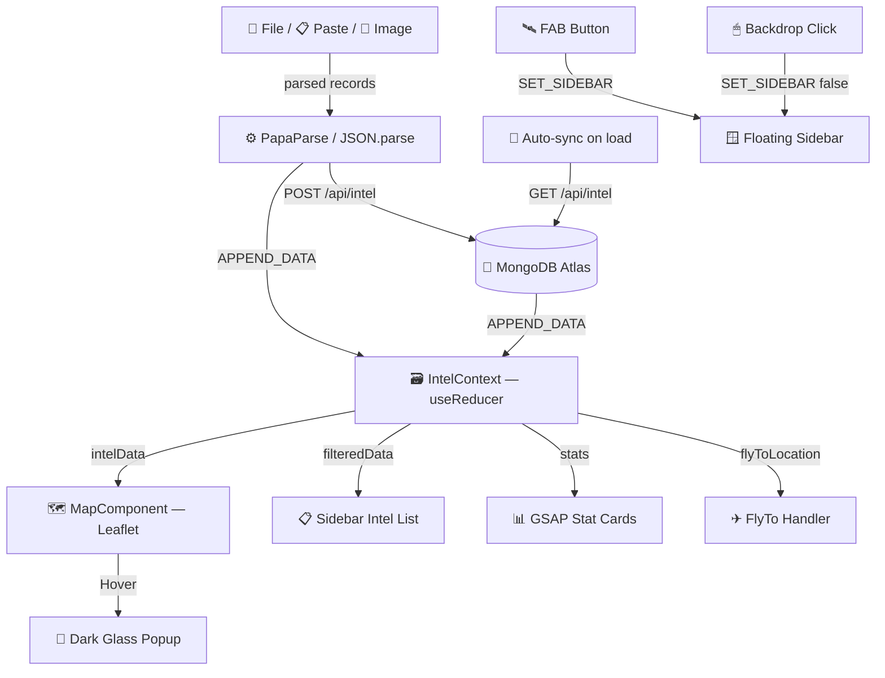

<div align="center">


<br/>


<br/><br/>

[](https://intel-fusion-dashboard-seven.vercel.app/)
&nbsp;
[](https://vercel.com/new/clone?repository-url=https%3A%2F%2Fgithub.com%2Fkinshukkush%2FINTEL-FUSION-DASHBOARD)
&nbsp;
[](https://github.com/kinshukkush/INTEL-FUSION-DASHBOARD/stargazers)

<br/>


</div>

---

<div align="center">

```
╔══════════════════════════════════════════════════════════════╗
║           CENTRALIZED INTELLIGENCE FUSION CENTER             ║
║    OSINT · HUMINT · IMINT  ──  GEOGRAPHIC VISUALIZATION      ║
╚══════════════════════════════════════════════════════════════╝
```

</div>

## ◈ Overview

The **Intel Fusion Dashboard** is a full-stack, dark-HUD web application for geographic intelligence analysis. Analysts can visualize **OSINT**, **HUMINT**, and **IMINT** data from multiple sources on a single interactive world map — backed by **MongoDB Atlas** for persistent, real-time storage across sessions.

Built for speed. Designed for operators.

---

## ◈ Intelligence Types

<div align="center">

| Marker | Type | Color | Source |
|:------:|------|:-----:|--------|
| 🔵 | **OSINT** — Open Source Intelligence | `#3B82F6` | Social media, news, intercepts |
| 🟢 | **HUMINT** — Human Intelligence | `#10B981` | Field assets, ground reports |
| 🔴 | **IMINT** — Imagery Intelligence | `#EF4444` | Satellite, drone, aerial feeds |

</div>

---

## ◈ Features

```
┌─────────────────────────────────────────────────────────────┐
│  🗺  FULL-SCREEN MAP     Dark CartoDB tiles, radar-ping      │
│                          markers, hover popups, clustering   │
│                                                             │
│  🪟  FLOATING SIDEBAR    Spring-physics animation, GSAP      │
│                          stat counters, live search/filter  │
│                                                             │
│  🍃  MONGODB ATLAS       Auto-sync on load, PULL/SEED/PUSH  │
│                          controls, REST API (/api/intel)    │
│                                                             │
│  📂  DATA INGESTION      Drag-drop JSON/CSV, paste raw      │
│                          text, upload images to pin on map  │
│                                                             │
│  🛰  LOADING SCREEN      Radar-sweep animation, typewriter  │
│                          text, vertical split-reveal        │
│                                                             │
│  🇮🇳  INDIA + LPU DATA   25 pre-loaded intel points across  │
│                          major cities + LPU Phagwara campus │
└─────────────────────────────────────────────────────────────┘
```

---

## ◈ Quick Start

### ⚡ One-Click Deploy

> **Live:** 👉 [intel-fusion-dashboard-seven.vercel.app](https://intel-fusion-dashboard-seven.vercel.app/)

After deploy, add environment variables in **Vercel → Project Settings → Environment Variables**:

```env
MONGODB_URI=mongodb+srv://<user>:<password>@<cluster>.mongodb.net/intel_fusion
MONGODB_DB=intel_fusion
```

### 🖥️ Run Locally

```bash
git clone https://github.com/kinshukkush/INTEL-FUSION-DASHBOARD.git
cd INTEL-FUSION-DASHBOARD
npm install
npm run dev
```

Create `.env.local` in project root:

```env
MONGODB_URI=mongodb+srv://<user>:<password>@<cluster>.mongodb.net/intel_fusion?appName=<appName>
MONGODB_DB=intel_fusion
```

Open [http://localhost:3000](http://localhost:3000) 🚀

---

## ◈ MongoDB Atlas Controls

| Button | Action |
|--------|--------|
| **PULL** | Fetch all records from MongoDB → merge into map view |
| **SEED** | Populate MongoDB with 25-point built-in dataset |
| **PUSH** | Upload all visible intel points to MongoDB |

> App **auto-syncs on load** — MongoDB records appear on every visit automatically.

### API Reference

| Method | Endpoint | Description |
|--------|----------|-------------|
| `GET` | `/api/intel` | Fetch all records |
| `POST` | `/api/intel` | Insert one or many records |
| `DELETE` | `/api/intel` | Clear all records |
| `POST` | `/api/intel/seed` | Seed built-in 25-point dataset |
| `GET` | `/api/intel/seed` | Get current record count |

---

## ◈ How to Use

| Action | How |
|--------|-----|
| Open sidebar | Click **blue FAB** — bottom-left radar button |
| Close sidebar | Click **outside** the panel or press **✕** |
| Filter by type | Use **ALL / OSINT / HUMINT / IMINT** filter pills |
| Search | Type in the **search box** — live filters title & description |
| Fly to location | **Click any intel card** in the list |
| Hover popup | **Hover any map marker** — see image + metadata |
| Drop a file | **INGEST DATA → 📁 File** — drag `.json` or `.csv` |
| Paste data | **INGEST DATA → 📋 Paste** — paste JSON or CSV |
| Upload image | **INGEST DATA → 📸 Image** — upload JPG/PNG + fill coords |
| Sync MongoDB | **MONGODB ATLAS panel** → PULL / SEED / PUSH |

---

## ◈ System Architecture



### Data Flow

1. **On load** → `GET /api/intel` → MongoDB records merged into context via `APPEND_DATA` (no duplicates)
2. **Ingest pipeline** → File / paste / image → parser → `APPEND_DATA` + `POST /api/intel` to persist
3. **Map layer** → `MapComponent` renders markers from context. Hover fires popup, click fires `FLY_TO`
4. **Sidebar** → Framer Motion spring mount. GSAP animates stat counts. `AnimatePresence` staggers list items

---

## ◈ Tech Stack

| Technology | Role |
|-----------|------|
| **Next.js 16** | App Router, `/api/intel` REST routes, SSR bypass for Leaflet |
| **React 19 + TypeScript** | Component tree, `useReducer` global state, full type safety |
| **MongoDB Atlas** | Persistent intel storage, REST CRUD via `mongodb` driver |
| **Leaflet + react-leaflet** | Interactive map, custom SVG markers, clusters, hover popups |
| **Framer Motion 12** | Spring sidebar, `AnimatePresence`, stagger transitions |
| **GSAP 3.15** | Stat card counter tweening |
| **Tailwind CSS v4** | Layout and spacing |
| **PapaParse** | CSV streaming parser |
| **react-dropzone** | Drag-and-drop file ingestion |

---


## ◈ Developer

<div align="center">


<br/><br/>

[](https://github.com/kinshukkush)
[](https://www.linkedin.com/in/kinshuk-saxena-/)
[](https://kinshuk.unaux.com)
[](mailto:kinshuksaxena3@gmail.com)

<br/>

> *Built with precision. Deployed with purpose.*

⭐ **Drop a star if this project impressed you** ⭐

</div>

---

<div align="center">


</div>